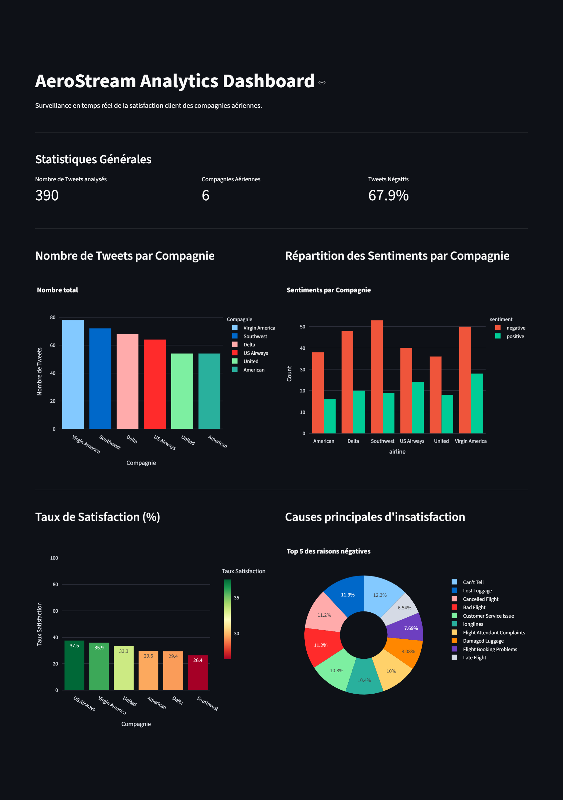

# ✈️ AeroStream Analytics

    

**AeroStream Analytics** est une solution **End-to-End MLOps** conçue pour analyser en temps réel le sentiment des clients de compagnies aériennes. Le projet simule un flux de données, classifie les tweets grâce à un modèle NLP (Support Vector Classifier + Sentence Transformers), et orchestre le tout via une architecture microservices conteneurisée.

---

## 🏗️ Architecture du Projet

Le système repose sur une architecture **Microservices** où chaque composant est isolé dans un conteneur Docker.

1. **Orchestrateur (Airflow) :** Déclenche le pipeline toutes les minutes.

2. **Backend (FastAPI) :**

    - Génère des tweets synthétiques réalistes (Faker).

    - Transforme le texte en vecteurs (Embeddings).

    - Prédit le sentiment (Positif, Négatif, Neutre).

3. **Database (PostgreSQL) :** Stocke l'historique des tweets et des prédictions.

4. **Frontend (Streamlit) :** Affiche des KPIs et graphiques interactifs avec rafraîchissement automatique.

<br>

## 🛠️ Stack Technique

- **Langage :** Python 3.10

- **API & Backend :** FastAPI, Pydantic, SQLAlchemy.

- **Machine Learning :**

    - ***Embedding :*** *sentence-transformers/paraphrase-multilingual-mpnet-base-v2*

    - ***Classification :*** *Scikit-Learn (LinearSVC)*

- **Orchestration :** Apache Airflow (LocalExecutor).

- **Visualisation :** Streamlit, Plotly Express.

- **Base de Données :** PostgreSQL.

- **Infrastructure :** Docker & Docker Compose.

<br>

## 📂 Structure du Projet

```bash
.
├── airflow/               # Configuration de l'orchestrateur
│   ├── dags/              # Pipelines (DAGs)
│   └── Dockerfile
├── app/                   # Dashboard Streamlit
│   ├── app.py
│   └── Dockerfile
├── fastapi/               # API et Modèles ML
│   ├── main.py            # Endpoints API
│   ├── pipeline.py        # Logique métier
│   ├── database.py        # Connexion DB
│   ├── model_service.py   # Inférence ML
│   └── Dockerfile
├── models/                # Stockage des modèles (.pkl)
├── docker-compose.yaml    # Définition des services
└── requirements.txt
```

<br>

## 🚀 Installation et Démarrage

**Prérequis :**

- Docker Desktop installé.

- Git.

### **1. Cloner le dépôt :**

```bash
git clone [https://github.com/ABDELHAFIDAIT/AeroStream.git](https://github.com/ABDELHAFIDAIT/AeroStream.git)

cd aerostream
```

### **2. Lancer les services :**

Tout le projet est conteneurisé. Une seule commande suffit :

```bash
docker-compose up --build -d
```


### **3. Créer l'utilisateur Airflow (Premier lancement uniquement) :**

Une fois les conteneurs lancés, créez un compte admin pour l'orchestrateur :

```bash
docker exec -it aerostream_airflow airflow users create --username admin --firstname Admin --lastname User --role Admin --email admin@aerostream.com --password admin
```

<br>

## 🖥️ Utilisation :

Une fois l'infrastructure démarrée, vous pouvez accéder aux différentes interfaces :

| Service              | URL                          | Description                                                                 |
|----------------------|------------------------------|-----------------------------------------------------------------------------|
| Streamlit Dashboard  | http://localhost:8501        | Visualisation des données et KPIs en temps réel.                            |
| Airflow UI           | http://localhost:8080        | Monitoring des DAGs (Login: admin / admin).                                 |
| FastAPI Docs         | http://localhost:8000/docs   | Documentation Swagger de l'API et test des endpoints.                       |
| PgAdmin              | http://localhost:5050        | Interface SQL (Email: admin@aerostream.com / Pass: admin).                  |


**Scénario de test :**

- Ouvrez **Airflow** et activez le DAG `aerostream_orchestrator` (bouton ON/OFF).

- Le DAG va s'exécuter toutes les minutes, appelant l'API pour générer et classer 20 tweets.

- Ouvrez **Streamlit** : vous verrez les graphiques se mettre à jour automatiquement toutes les 30 secondes avec les nouvelles données.


<br>

## 📊 Aperçu du Dashboard

Les fonctionnalités clés du tableau de bord incluent :

- **Volume de tweets** par compagnie aérienne.

- **Analyse de sentiment** (Répartition Positif/Négatif/Neutre).

- **Identification des causes** de mécontentement (Bagages perdus, retards, etc.).

- **Mode Simulation :** Possibilité de générer des tweets manuellement via la barre latérale.



<br>

## 👤 Auteur
Abdelhafid AIT EL MOKHTAR - AI Developper @ YouCode

- [Linkedin](www.linkedin.com/in/abdelhafid-ait-el-mokhtar-670491245)

- [Email](mailto:abdelhafid02002@gmail.com)

